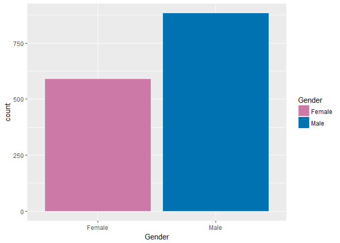
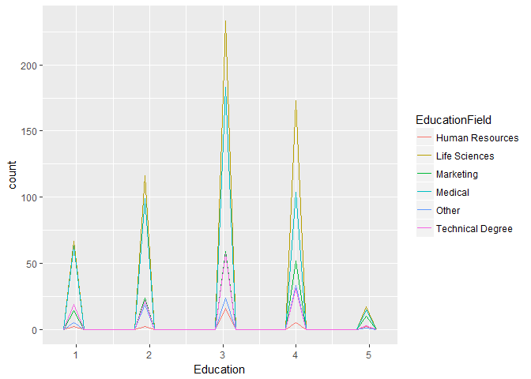
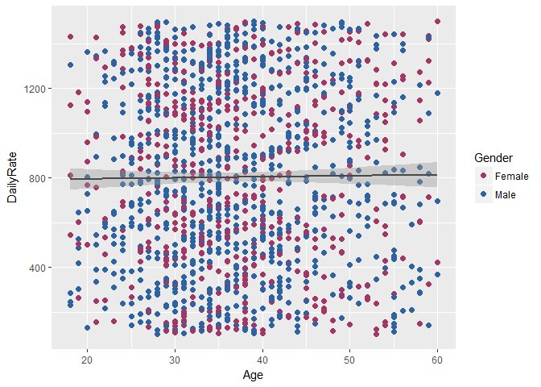
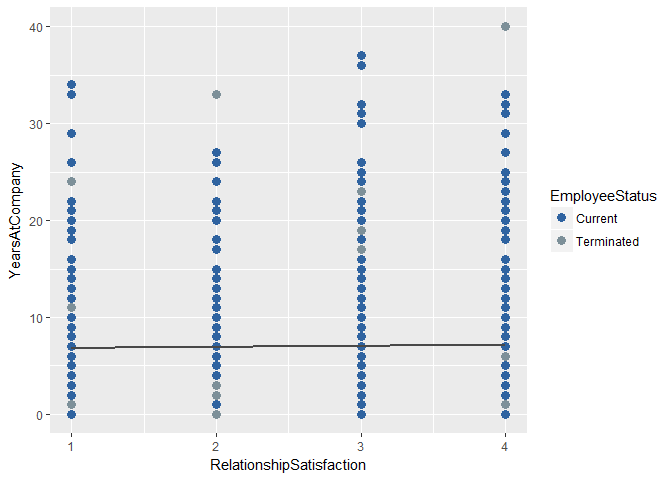
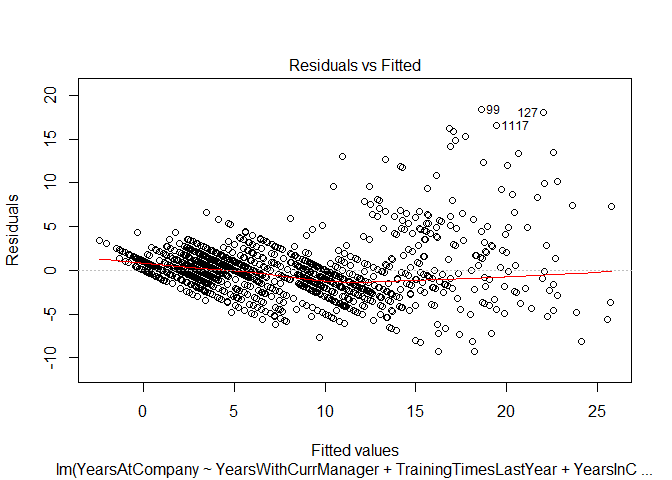
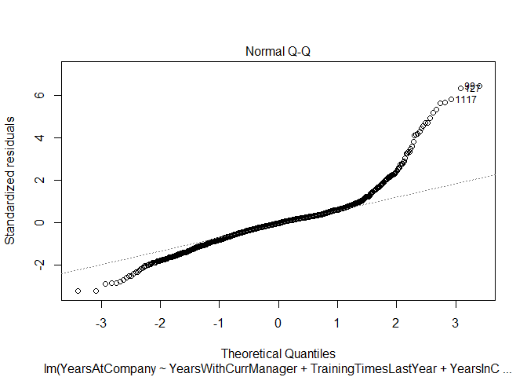
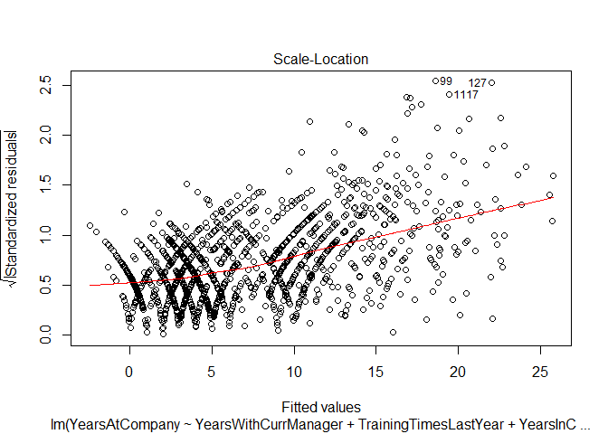
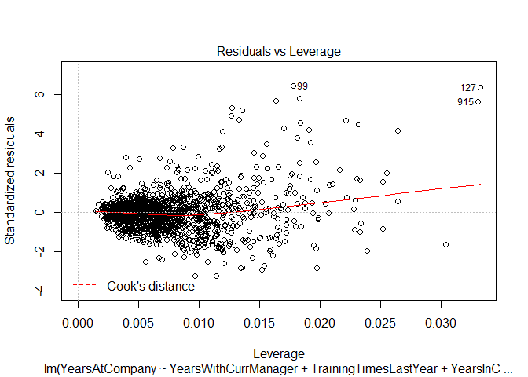

## Business Objective
The leadership has identified predicting employee turnover as its first application of data science for talent management. Before investing in the project they would like an analysis of existing employee data.  

## Data
Data was provided by the client in form of a .csv file "CaseStudy2-data.xlsx".

####Basic Statistics
The data includes a total of 1470 current and terminated employee records with 35 variables. 

<table class="table table-striped" style="width: auto !important; ">
 <thead>
  <tr>
   <th style="text-align:left;">   </th>
   <th style="text-align:right;"> Data Records </th>
  </tr>
 </thead>
<tbody>
  <tr>
   <td style="text-align:left;"> Observations </td>
   <td style="text-align:right;"> 1470 </td>
  </tr>
  <tr>
   <td style="text-align:left;"> Variables </td>
   <td style="text-align:right;"> 35 </td>
  </tr>
</tbody>
</table>
Summary of measures included in the data:
<table class="table table-striped" style="width: auto !important; margin-left: auto; margin-right: auto;">
 <thead>
  <tr>
   <th style="text-align:left;">   </th>
   <th style="text-align:right;"> DailyRate </th>
   <th style="text-align:right;"> Number of Companies Worked </th>
   <th style="text-align:right;"> Years at Company </th>
   <th style="text-align:right;"> Years with Manager </th>
   <th style="text-align:right;"> Distance From Home </th>
   <th style="text-align:right;"> Percent Salary Hike </th>
   <th style="text-align:right;"> Years in Current Role </th>
  </tr>
 </thead>
<tbody>
  <tr>
   <td style="text-align:left;"> Min. </td>
   <td style="text-align:right;"> 102.0000 </td>
   <td style="text-align:right;"> 0.000000 </td>
   <td style="text-align:right;"> 0.000000 </td>
   <td style="text-align:right;"> 0.000000 </td>
   <td style="text-align:right;"> 1.000000 </td>
   <td style="text-align:right;"> 11.00000 </td>
   <td style="text-align:right;"> 0.000000 </td>
  </tr>
  <tr>
   <td style="text-align:left;"> 1st Qu. </td>
   <td style="text-align:right;"> 465.0000 </td>
   <td style="text-align:right;"> 1.000000 </td>
   <td style="text-align:right;"> 3.000000 </td>
   <td style="text-align:right;"> 2.000000 </td>
   <td style="text-align:right;"> 2.000000 </td>
   <td style="text-align:right;"> 12.00000 </td>
   <td style="text-align:right;"> 2.000000 </td>
  </tr>
  <tr>
   <td style="text-align:left;"> Median </td>
   <td style="text-align:right;"> 802.0000 </td>
   <td style="text-align:right;"> 2.000000 </td>
   <td style="text-align:right;"> 5.000000 </td>
   <td style="text-align:right;"> 3.000000 </td>
   <td style="text-align:right;"> 7.000000 </td>
   <td style="text-align:right;"> 14.00000 </td>
   <td style="text-align:right;"> 3.000000 </td>
  </tr>
  <tr>
   <td style="text-align:left;"> Mean </td>
   <td style="text-align:right;"> 802.4857 </td>
   <td style="text-align:right;"> 2.693197 </td>
   <td style="text-align:right;"> 7.008163 </td>
   <td style="text-align:right;"> 4.123129 </td>
   <td style="text-align:right;"> 9.192517 </td>
   <td style="text-align:right;"> 15.20952 </td>
   <td style="text-align:right;"> 4.229252 </td>
  </tr>
  <tr>
   <td style="text-align:left;"> 3rd Qu. </td>
   <td style="text-align:right;"> 1157.0000 </td>
   <td style="text-align:right;"> 4.000000 </td>
   <td style="text-align:right;"> 9.000000 </td>
   <td style="text-align:right;"> 7.000000 </td>
   <td style="text-align:right;"> 14.000000 </td>
   <td style="text-align:right;"> 18.00000 </td>
   <td style="text-align:right;"> 7.000000 </td>
  </tr>
  <tr>
   <td style="text-align:left;"> Max. </td>
   <td style="text-align:right;"> 1499.0000 </td>
   <td style="text-align:right;"> 9.000000 </td>
   <td style="text-align:right;"> 40.000000 </td>
   <td style="text-align:right;"> 17.000000 </td>
   <td style="text-align:right;"> 29.000000 </td>
   <td style="text-align:right;"> 25.00000 </td>
   <td style="text-align:right;"> 18.000000 </td>
  </tr>
</tbody>
</table>
##Methodology
Attrition is the central theme of this analysis. We interpreted the value "Yes" in the data provided under attrition as an indicator that the employee is terminated.

We categorized each record as "Current" or "Terminated" and look for patterns in the variables that may explain why employees become terminated.  

*__Current__ meaning currently employed by the firm.*  
*__Terminated__ meaning left the firm (voluntarily or non-voluntarily)*


As requested employees under the age of 18 have been excluded from this analsyis. The table below shows the youngest age record included in the data:
<table class="table table-striped" style="width: auto !important; ">
 <thead>
  <tr>
   <th style="text-align:right;"> Youngest Age Record </th>
  </tr>
 </thead>
<tbody>
  <tr>
   <td style="text-align:right;"> 18 </td>
  </tr>
</tbody>
</table>
####Distributions  
The following are the distributions of employees by various measures.


####Frequencies  
The following are frequencies by Gender and Job Roles

  
As requested we have captured the counts of management positions in the table below:

<table class="table table-striped" style="width: auto !important; ">
 <thead>
  <tr>
   <th style="text-align:left;">   </th>
   <th style="text-align:right;"> Count </th>
  </tr>
 </thead>
<tbody>
  <tr>
   <td style="text-align:left;"> Sales Executives </td>
   <td style="text-align:right;"> 326 </td>
  </tr>
  <tr>
   <td style="text-align:left;"> Manufacturing Directors </td>
   <td style="text-align:right;"> 145 </td>
  </tr>
  <tr>
   <td style="text-align:left;"> Managers </td>
   <td style="text-align:right;"> 102 </td>
  </tr>
  <tr>
   <td style="text-align:left;"> Research Directors </td>
   <td style="text-align:right;"> 80 </td>
  </tr>
</tbody>
</table>
####Is there a relationship between Age and Income?  
There's no apparent relationship between Age and Income. The plot below shows a very slight upward incline as age increases but is relatively insignificant.  


####Is there a relationship between life satisfaction and any other attribute?  



####What are the top 3 factors that lead to attrition?

Using the Stepwise Variable selction method we have determined that the most effective predictors of years with the company are Years with Current Manager, Training Times Last Year,	Years In CurrentRole,	Years Since Last Promotion,	Number of Companies Worked,	Age,	Monthly Income,	Job Involvement, Percent Salary Hike and DailyRate.

These factors can be used to predict how long in years an employee will stay with the company using a statistical formula.

We advise caution be used in decision making based on the following variables for ethical or even legal reasons:
* Gender  
* Marital Status  
* Relationship Satisfaction  
* Total Working Years
* Age

Our model actually only uses one of these factors (Age) which if used as a factor in decision making could be considered discriminatory therefore this analysis should be used with caution.

Inference can only be drawn to the employees in our dataset and not an larger external population.


The top 3 factors that predict how long an employee will stay with the company in years are Years With Current Manager, Training Times Last Year and YearsInCurrentRole    

Though this analysis is significant it is merely a proof of concept; higher quality results can be achieved wiht additional time and resources for analyzing the data.

####Appendix

```
## Stepwise Selection Method   
## ---------------------------
## 
## Candidate Terms: 
## 
## 1. Age 
## 2. DailyRate 
## 3. DistanceFromHome 
## 4. Education 
## 5. EnvironmentSatisfaction 
## 6. HourlyRate 
## 7. JobInvolvement 
## 8. JobLevel 
## 9. JobSatisfaction 
## 10. MonthlyIncome 
## 11. MonthlyRate 
## 12. NumCompaniesWorked 
## 13. PercentSalaryHike 
## 14. PerformanceRating 
## 15. RelationshipSatisfaction 
## 16. StockOptionLevel 
## 17. TotalWorkingYears 
## 18. TrainingTimesLastYear 
## 19. WorkLifeBalance 
## 20. YearsInCurrentRole 
## 21. YearsSinceLastPromotion 
## 22. YearsWithCurrManager 
## 
## We are selecting variables based on p value...
## 
## Variables Entered/Removed: 
## 
## - YearsWithCurrManager added 
## - TrainingTimesLastYear added 
## - YearsInCurrentRole added 
## - YearsSinceLastPromotion added 
## - NumCompaniesWorked added 
## - Age added 
## - MonthlyIncome added 
## - JobInvolvement added 
## - PercentSalaryHike added 
## - DailyRate added 
## 
## No more variables to be added/removed.
## 
## 
## Final Model Output 
## ------------------
## 
##                         Model Summary                          
## --------------------------------------------------------------
## R                       0.884       RMSE                2.877 
## R-Squared               0.781       Coef. Var          41.051 
## Adj. R-Squared          0.779       MSE                 8.277 
## Pred R-Squared          0.775       MAE                 1.897 
## --------------------------------------------------------------
##  RMSE: Root Mean Square Error 
##  MSE: Mean Square Error 
##  MAE: Mean Absolute Error 
## 
##                                  ANOVA                                   
## ------------------------------------------------------------------------
##                  Sum of                                                 
##                 Squares          DF    Mean Square       F         Sig. 
## ------------------------------------------------------------------------
## Regression    43062.379          10       4306.238    520.292    0.0000 
## Residual      12075.523        1459          8.277                      
## Total         55137.902        1469                                     
## ------------------------------------------------------------------------
## 
##                                         Parameter Estimates                                          
## ----------------------------------------------------------------------------------------------------
##                   model      Beta    Std. Error    Std. Beta      t        Sig      lower     upper 
## ----------------------------------------------------------------------------------------------------
##             (Intercept)     2.117         0.563                  3.756    0.000     1.011     3.222 
##    YearsWithCurrManager     0.563         0.032        0.328    17.770    0.000     0.500     0.625 
##   TrainingTimesLastYear     0.240         0.020        0.305    12.143    0.000     0.202     0.279 
##      YearsInCurrentRole     0.468         0.032        0.277    14.780    0.000     0.406     0.530 
## YearsSinceLastPromotion     0.310         0.029        0.163    10.714    0.000     0.254     0.367 
##      NumCompaniesWorked    -0.286         0.033       -0.117    -8.769    0.000    -0.350    -0.222 
##                     Age    -0.030         0.012       -0.045    -2.589    0.010    -0.053    -0.007 
##           MonthlyIncome     0.000         0.000        0.047     2.443    0.015     0.000     0.000 
##          JobInvolvement    -0.191         0.106       -0.022    -1.807    0.071    -0.399     0.016 
##       PercentSalaryHike    -0.036         0.021       -0.021    -1.742    0.082    -0.076     0.005 
##               DailyRate     0.000         0.000       -0.021    -1.716    0.086    -0.001     0.000 
## ----------------------------------------------------------------------------------------------------
```

```
## 
##                                       Stepwise Selection Summary                                        
## -------------------------------------------------------------------------------------------------------
##                                     Added/                   Adj.                                          
## Step           Variable            Removed     R-Square    R-Square      C(p)          AIC        RMSE     
## -------------------------------------------------------------------------------------------------------
##    1     YearsWithCurrManager      addition       0.592       0.591    1244.3580    8189.0915    3.9161    
##    2     TrainingTimesLastYear     addition       0.687       0.687     610.6050    7798.1456    3.4274    
##    3      YearsInCurrentRole       addition       0.744       0.744     234.6420    7504.4996    3.1005    
##    4    YearsSinceLastPromotion    addition       0.764       0.763     107.8300    7390.4311    2.9815    
##    5      NumCompaniesWorked       addition       0.777       0.777      19.5680    7305.2675    2.8954    
##    6              Age              addition       0.779       0.778      13.4860    7299.2046    2.8885    
##    7         MonthlyIncome         addition       0.780       0.779       9.2750    7294.9777    2.8833    
##    8        JobInvolvement         addition       0.780       0.779       7.8470    7293.5298    2.8810    
##    9       PercentSalaryHike       addition       0.781       0.779       6.6830    7292.3412    2.8788    
##   10           DailyRate           addition       0.781       0.779       5.7510    7291.3789    2.8769    
## -------------------------------------------------------------------------------------------------------
```

```
## 
## Call:
## lm(formula = YearsAtCompany ~ YearsWithCurrManager + TrainingTimesLastYear + 
##     YearsInCurrentRole + YearsSinceLastPromotion + NumCompaniesWorked + 
##     Age + MonthlyIncome + JobInvolvement + PercentSalaryHike + 
##     DailyRate, data = MyPredictionData)
## 
## Coefficients:
##             (Intercept)     YearsWithCurrManager    TrainingTimesLastYear  
##               2.117e+00                5.626e-01                2.404e-01  
##      YearsInCurrentRole  YearsSinceLastPromotion       NumCompaniesWorked  
##               4.678e-01                3.104e-01               -2.857e-01  
##                     Age            MonthlyIncome           JobInvolvement  
##              -2.995e-02                6.177e-05               -1.914e-01  
##       PercentSalaryHike                DailyRate  
##              -3.578e-02               -3.204e-04
```

<!-- --><!-- --><!-- --><!-- -->
