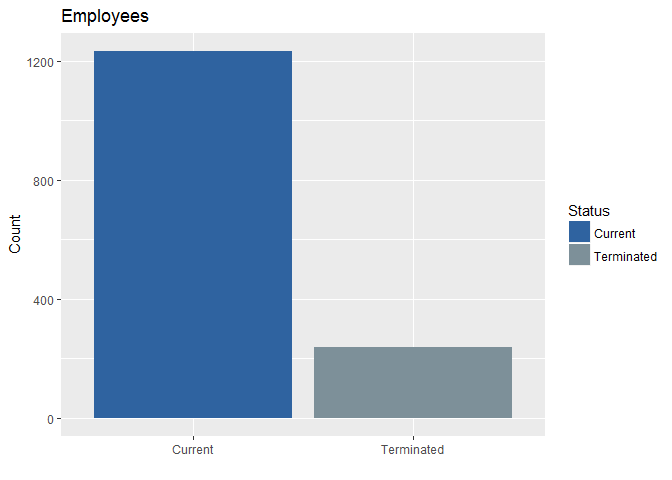
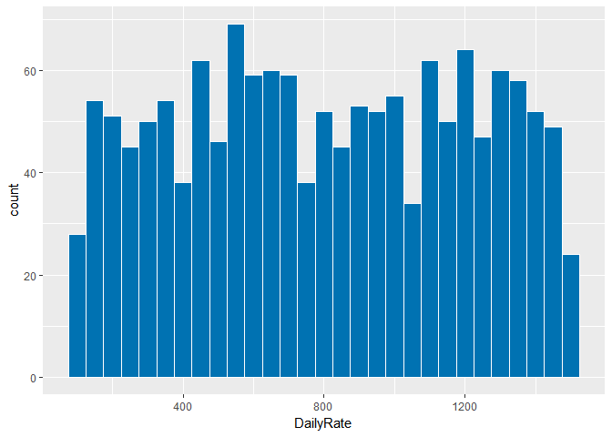
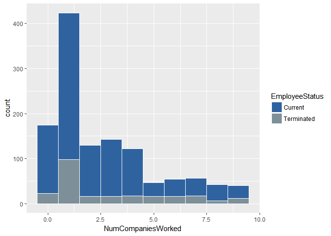
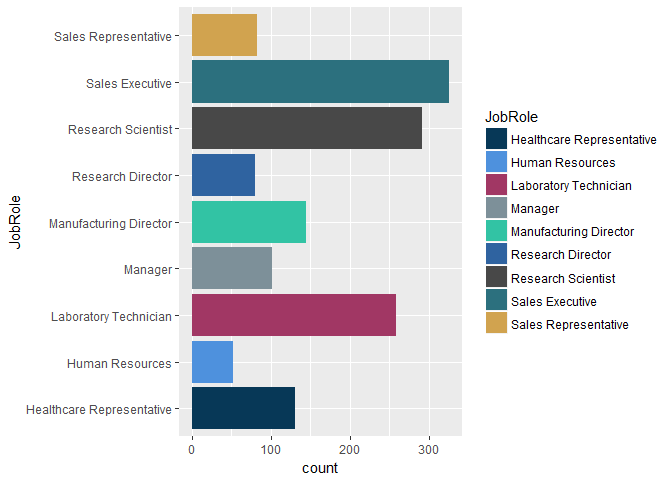
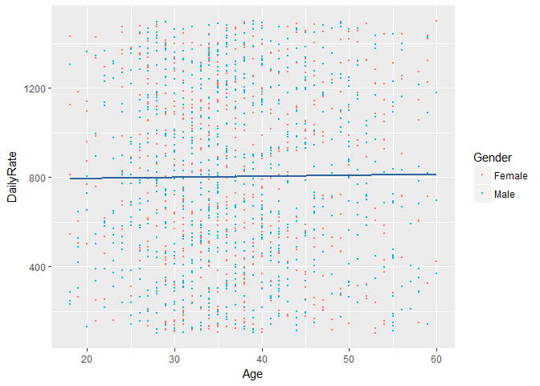
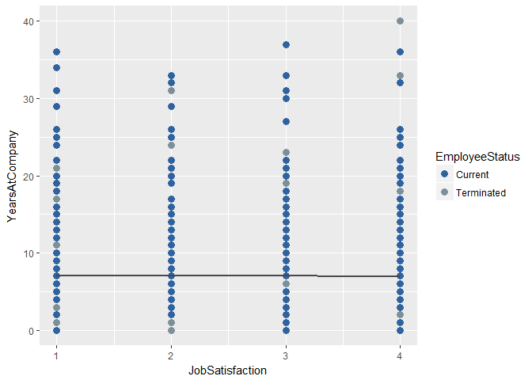
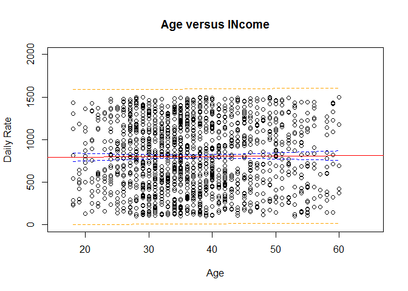

## Business Objective
The leadership has identified predicting employee turnover as its first application of data science for talent management. Before investing in the project they would like an analysis of existing employee data.  

## Data
Data was provided by the client in form of a .csv file "CaseStudy2-data.xlsx".

####Basic Statistics
The data includes a total of 1470 current and terminated employee records with 35 variables. 

<table class="table table-striped" style="width: auto !important; ">
 <thead>
  <tr>
   <th style="text-align:left;">   </th>
   <th style="text-align:right;"> Data Records </th>
  </tr>
 </thead>
<tbody>
  <tr>
   <td style="text-align:left;"> Observations </td>
   <td style="text-align:right;"> 1470 </td>
  </tr>
  <tr>
   <td style="text-align:left;"> Variables </td>
   <td style="text-align:right;"> 35 </td>
  </tr>
</tbody>
</table>
Summary of measures included in the data:
<table class="table table-striped" style="width: auto !important; margin-left: auto; margin-right: auto;">
 <thead>
  <tr>
   <th style="text-align:left;">   </th>
   <th style="text-align:right;"> DailyRate </th>
   <th style="text-align:right;"> Number of Companies Worked </th>
   <th style="text-align:right;"> Years at Company </th>
   <th style="text-align:right;"> Years with Manager </th>
   <th style="text-align:right;"> Distance From Home </th>
   <th style="text-align:right;"> Percent Salary Hike </th>
   <th style="text-align:right;"> Years in Current Role </th>
  </tr>
 </thead>
<tbody>
  <tr>
   <td style="text-align:left;"> Min. </td>
   <td style="text-align:right;"> 102.0000 </td>
   <td style="text-align:right;"> 0.000000 </td>
   <td style="text-align:right;"> 0.000000 </td>
   <td style="text-align:right;"> 0.000000 </td>
   <td style="text-align:right;"> 1.000000 </td>
   <td style="text-align:right;"> 11.00000 </td>
   <td style="text-align:right;"> 0.000000 </td>
  </tr>
  <tr>
   <td style="text-align:left;"> 1st Qu. </td>
   <td style="text-align:right;"> 465.0000 </td>
   <td style="text-align:right;"> 1.000000 </td>
   <td style="text-align:right;"> 3.000000 </td>
   <td style="text-align:right;"> 2.000000 </td>
   <td style="text-align:right;"> 2.000000 </td>
   <td style="text-align:right;"> 12.00000 </td>
   <td style="text-align:right;"> 2.000000 </td>
  </tr>
  <tr>
   <td style="text-align:left;"> Median </td>
   <td style="text-align:right;"> 802.0000 </td>
   <td style="text-align:right;"> 2.000000 </td>
   <td style="text-align:right;"> 5.000000 </td>
   <td style="text-align:right;"> 3.000000 </td>
   <td style="text-align:right;"> 7.000000 </td>
   <td style="text-align:right;"> 14.00000 </td>
   <td style="text-align:right;"> 3.000000 </td>
  </tr>
  <tr>
   <td style="text-align:left;"> Mean </td>
   <td style="text-align:right;"> 802.4857 </td>
   <td style="text-align:right;"> 2.693197 </td>
   <td style="text-align:right;"> 7.008163 </td>
   <td style="text-align:right;"> 4.123129 </td>
   <td style="text-align:right;"> 9.192517 </td>
   <td style="text-align:right;"> 15.20952 </td>
   <td style="text-align:right;"> 4.229252 </td>
  </tr>
  <tr>
   <td style="text-align:left;"> 3rd Qu. </td>
   <td style="text-align:right;"> 1157.0000 </td>
   <td style="text-align:right;"> 4.000000 </td>
   <td style="text-align:right;"> 9.000000 </td>
   <td style="text-align:right;"> 7.000000 </td>
   <td style="text-align:right;"> 14.000000 </td>
   <td style="text-align:right;"> 18.00000 </td>
   <td style="text-align:right;"> 7.000000 </td>
  </tr>
  <tr>
   <td style="text-align:left;"> Max. </td>
   <td style="text-align:right;"> 1499.0000 </td>
   <td style="text-align:right;"> 9.000000 </td>
   <td style="text-align:right;"> 40.000000 </td>
   <td style="text-align:right;"> 17.000000 </td>
   <td style="text-align:right;"> 29.000000 </td>
   <td style="text-align:right;"> 25.00000 </td>
   <td style="text-align:right;"> 18.000000 </td>
  </tr>
</tbody>
</table>
##Methodology
Attrition is the central theme of this analysis. We interpreted the value "Yes" in the data provided under attrition as an indicator that the employee has left the company.

We categorized each record as "Current" or "Terminated" and look for patterns in the variables that may explain why employees become terminated.  

*__Current__ meaning currently employed by the firm.*  
*__Terminated__ meaning left the firm (voluntarily or non-voluntarily)*




As requested employees under the age of 18 have been excluded from this analsyis.
<table class="table table-striped" style="width: auto !important; ">
 <thead>
  <tr>
   <th style="text-align:right;"> Youngest Employee </th>
  </tr>
 </thead>
<tbody>
  <tr>
   <td style="text-align:right;"> 18 </td>
  </tr>
</tbody>
</table>
We advise caution be used in decision making based on the following variables for ethical or even legal reasons:  

* Age  
* Gender  
* Marital Status  
* Relationship Satisfaction  
* Total Working Years  

The following graph shows the distribution of employees by daily pay rate.

c	Give the frequencies (in table format or similar) for Gender, Education, and Occupation.  They can be separate tables, if that’s your choice.

d	Give the counts (again, pretty table) of management positions.

```
## [1] "data.frame"
```

<table class="table table-striped" style="width: auto !important; ">
 <thead>
  <tr>
   <th style="text-align:left;">   </th>
   <th style="text-align:right;"> Count </th>
  </tr>
 </thead>
<tbody>
  <tr>
   <td style="text-align:left;"> Sales Executives </td>
   <td style="text-align:right;"> 326 </td>
  </tr>
  <tr>
   <td style="text-align:left;"> Manufacturing Directors </td>
   <td style="text-align:right;"> 145 </td>
  </tr>
  <tr>
   <td style="text-align:left;"> Managers </td>
   <td style="text-align:right;"> 102 </td>
  </tr>
  <tr>
   <td style="text-align:left;"> Research Directors </td>
   <td style="text-align:right;"> 80 </td>
  </tr>
</tbody>
</table>
There's no apparent relationship between Age and Income. The plot below shows a very slight upward incline as age increases but is relatively insignificant. 

d	What about Life Satisfaction?  Create another scatterplot.  Is there a discernible relationship there to what? 
<!-- --><!-- --><!-- -->
<!-- -->

determine factors that lead to attrition


identify (at least) the top three factors that contribute to turnover
The business is also interested in learning about any job role specific trends that may exist in the data set (e.g., “Data Scientists have the highest job satisfaction”

•	Evaluation/Results
•	Tell me the percentages
•	Tell me about any job role specific trends that may exist in the data set
•	Provide any other interesting trends and observations from your analysis
•	Other things to consider?
• Summary
•	Insights
•	Recommendations
•	Improvements
•	Questions
Have your presentation as a PDF ready to present on April 24. 
