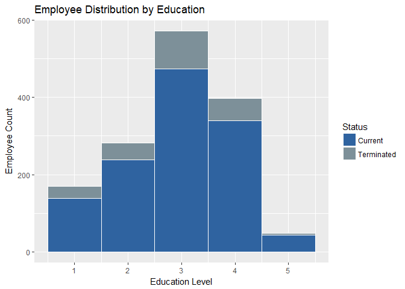

## Business Objective
The leadership has identified predicting employee turnover as its first application of data science for talent management. Before investing in the project they would like an analysis of existing employee data.  

## Data
Data was prvided by the client in form of a .csv file.  

####Basic Statistics
Oservations and Variables in the data that was provided included turned over employees and current employees.

<table class="table table-striped" style="width: auto !important; ">
 <thead>
  <tr>
   <th style="text-align:left;">   </th>
   <th style="text-align:right;"> Count </th>
  </tr>
 </thead>
<tbody>
  <tr>
   <td style="text-align:left;"> Observations </td>
   <td style="text-align:right;"> 1470 </td>
  </tr>
  <tr>
   <td style="text-align:left;"> Variables </td>
   <td style="text-align:right;"> 35 </td>
  </tr>
</tbody>
</table>
Preliminary data analysis; Data Structure, Quality Analysis etc.
b.	The column names are either too much or not enough.  Change the column names so that they do not have spaces, underscores, slashes, and the like. All column names should be under 12 characters. Make sure you’re updating your codebook with information on the tidied data set as well.

a	Remove all observations where the participant is under age 18.  No further analysis of underage individuals is permitted by your client.  Remove any other age outliers as you see fit, but be sure to tell what you’re doing and why.
<table class="table table-striped" style="width: auto !important; ">
 <thead>
  <tr>
   <th style="text-align:right;"> Youngest Employee </th>
  </tr>
 </thead>
<tbody>
  <tr>
   <td style="text-align:right;"> 18 </td>
  </tr>
</tbody>
</table>
b	Please provide (in pretty-fied table format or similar), descriptive statistics on at least 7 variables (age, Income, etc.). 
<table class="table table-striped" style="margin-left: auto; margin-right: auto;">
 <thead>
  <tr>
   <th style="text-align:left;">   </th>
   <th style="text-align:right;"> DailyRate </th>
   <th style="text-align:right;"> Number of Companies Worked </th>
   <th style="text-align:right;"> Years at Company </th>
   <th style="text-align:right;"> Years with Manager </th>
   <th style="text-align:right;"> Distance From Home </th>
   <th style="text-align:right;"> Percent Salary Hike </th>
   <th style="text-align:right;"> Years in Current Role </th>
  </tr>
 </thead>
<tbody>
  <tr>
   <td style="text-align:left;"> Min. </td>
   <td style="text-align:right;"> 102.0000 </td>
   <td style="text-align:right;"> 0.000000 </td>
   <td style="text-align:right;"> 0.000000 </td>
   <td style="text-align:right;"> 0.000000 </td>
   <td style="text-align:right;"> 1.000000 </td>
   <td style="text-align:right;"> 11.00000 </td>
   <td style="text-align:right;"> 0.000000 </td>
  </tr>
  <tr>
   <td style="text-align:left;"> 1st Qu. </td>
   <td style="text-align:right;"> 465.0000 </td>
   <td style="text-align:right;"> 1.000000 </td>
   <td style="text-align:right;"> 3.000000 </td>
   <td style="text-align:right;"> 2.000000 </td>
   <td style="text-align:right;"> 2.000000 </td>
   <td style="text-align:right;"> 12.00000 </td>
   <td style="text-align:right;"> 2.000000 </td>
  </tr>
  <tr>
   <td style="text-align:left;"> Median </td>
   <td style="text-align:right;"> 802.0000 </td>
   <td style="text-align:right;"> 2.000000 </td>
   <td style="text-align:right;"> 5.000000 </td>
   <td style="text-align:right;"> 3.000000 </td>
   <td style="text-align:right;"> 7.000000 </td>
   <td style="text-align:right;"> 14.00000 </td>
   <td style="text-align:right;"> 3.000000 </td>
  </tr>
  <tr>
   <td style="text-align:left;"> Mean </td>
   <td style="text-align:right;"> 802.4857 </td>
   <td style="text-align:right;"> 2.693197 </td>
   <td style="text-align:right;"> 7.008163 </td>
   <td style="text-align:right;"> 4.123129 </td>
   <td style="text-align:right;"> 9.192517 </td>
   <td style="text-align:right;"> 15.20952 </td>
   <td style="text-align:right;"> 4.229252 </td>
  </tr>
  <tr>
   <td style="text-align:left;"> 3rd Qu. </td>
   <td style="text-align:right;"> 1157.0000 </td>
   <td style="text-align:right;"> 4.000000 </td>
   <td style="text-align:right;"> 9.000000 </td>
   <td style="text-align:right;"> 7.000000 </td>
   <td style="text-align:right;"> 14.000000 </td>
   <td style="text-align:right;"> 18.00000 </td>
   <td style="text-align:right;"> 7.000000 </td>
  </tr>
  <tr>
   <td style="text-align:left;"> Max. </td>
   <td style="text-align:right;"> 1499.0000 </td>
   <td style="text-align:right;"> 9.000000 </td>
   <td style="text-align:right;"> 40.000000 </td>
   <td style="text-align:right;"> 17.000000 </td>
   <td style="text-align:right;"> 29.000000 </td>
   <td style="text-align:right;"> 25.00000 </td>
   <td style="text-align:right;"> 18.000000 </td>
  </tr>
</tbody>
</table>
Create a simple histogram for two of them.  Comment on the shape of the distribution in your markdown.

c	Give the frequencies (in table format or similar) for Gender, Education, and Occupation.  They can be separate tables, if that’s your choice.
<!-- -->

```
## `stat_bin()` using `bins = 30`. Pick better value with `binwidth`.
```

<!-- --><!-- --><!-- -->
d	Give the counts (again, pretty table) of management positions.

c	Is there a relationship between Age and Income?  Create a scatterplot and make an assessment of whether there is a relationship.  Color each point based on the Gender of the participant.  You’re welcome to use lm() or similar functions to back up your claims.

d	What about Life Satisfaction?  Create another scatterplot.  Is there a discernible relationship there to what?   


The executive leadership has identified predicting employee turnover as its first application of data science for talent management. Before the business green lights the project, they have tasked your data science team to conduct an analysis of existing employee data.

determine factors that lead to attrition
identify (at least) the top three factors that contribute to turnover
The business is also interested in learning about any job role specific trends that may exist in the data set (e.g., “Data Scientists have the highest job satisfaction”

•	Title
•	Authors all listed
•	Presentation Outline
•	Business Objectives
•	Data Sourced
•	Methodology
•	Evaluation/Results
•	Summary
•	Business Objectives
•	Data Source	
•	Where you got it 
•	Basic Statistics 
•	Methodology	
•	Steps 
•	Workflow
•	Evaluation/Results
•	Tell me the percentages
•	Show me graphs with explanations
•	The top three factors that contribute to turnover
•	Tell me about any job role specific trends that may exist in the data set
•	Provide any other interesting trends and observations from your analysis
•	Other things to consider?
•	Summary 
•	Insights
•	Recommendations
•	Improvements
•	Questions
Have your presentation as a PDF ready to present on April 24. 

c	Some columns are, due to Qualtrics, malfunctioning.  
d	Make sure your columns are the proper data types (i.e., numeric, character, etc.).  If they are incorrect, convert them.
